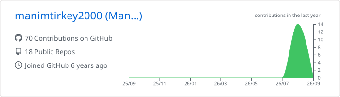
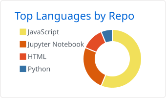
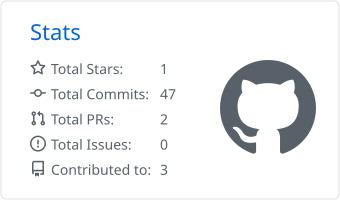
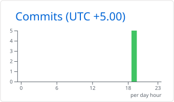

<!--
  Header GIF: the original filename contains spaces + an emoji, which breaks the raw URL.
  The line below is the URL-encoded version so it works as-is.
  Cleaner option: rename the file in your repo to `header.gif`.
-->

Hi there! 👋 I am **Manim Tirkey**, a Frontend & Fullstack Software Engineer with a Master's in Computer Science from Virginia Tech and 3+ years of experience building high-performance, scalable web applications.

Currently, I am a Frontend Software Engineer at **Cloudsufi**, building open-source data discovery tools for **Google Cloud Dataplex**. Previously, I engineered React and TypeScript applications serving 10M+ users at **Optum (UnitedHealth Group)**.

**Tech Stack & Interests**

- **Frontend:** TypeScript, JavaScript (ES6+), React, Next.js, Redux, Context API, Material UI, Tailwind CSS
- **Backend & APIs:** Node.js, Next.js API Routes, GraphQL, REST, PostgreSQL, WebSockets
- **Testing & Tools:** Jest, React Testing Library, Docker, Jenkins CI/CD, AWS
- **AI & Automation:** Agentic workflows, OpenAI API, Claude, GitHub Copilot

I am passionate about UI performance optimization (Core Web Vitals), accessible design (WCAG/ARIA), and building LLM-powered application workflows.

---

## My favorite tools and technologies ⚙️

> Tools and technologies that I have worked with and am interested in

  

  

  

---

## GitHub stats 📊

<!--
  These now point at SVGs committed into this repo by
  .github/workflows/profile-cards.yml — no external service involved,
  so they can never 503 or hit a rate limit.
  Confirm the exact filenames under profile-summary-card-output/ after the
  first workflow run; swap `github` for another theme folder if you prefer.
-->

  
  

  
  

### Contribution graph 🐍

<!--
  Replaces the old github-readme-activity-graph card, which is another
  unmaintained public Vercel app. This snake animation is generated by
  .github/workflows/snake.yml and committed to the `output` branch,
  so it renders from GitHub's own CDN.
-->
<picture>
  <source media="(prefers-color-scheme: dark)" srcset="https://raw.githubusercontent.com/manimtirkey2000/manimtirkey2000/output/github-snake-dark.svg" />
  
</picture>

### Contribution streak 🔥

<!--
  streak-stats.demolab.com is intermittently down. This mirror is the one
  people currently report as reliable. If it blanks too, deploy your own copy
  of DenverCoder1/github-readme-streak-stats to Vercel and use that URL instead.
-->

---

## GitHub Profile Trophy 🏆

<!--
  Generated in-repo by .github/workflows/trophy.yml — no external service.
  Run that workflow once from the Actions tab before pushing this README.

  If you'd rather keep it live, these mirrors from ryo-ma's load-balancing
  list are current; pick one and use it as the host:
    https://trophy.benkou.dev/?username=manimtirkey2000
    https://gh-trophy.cdnsoft.net/?username=manimtirkey2000
    https://trophy.ryglcloud.net/?username=manimtirkey2000
    https://github-trophies.devomb.com/?username=manimtirkey2000
-->

---

